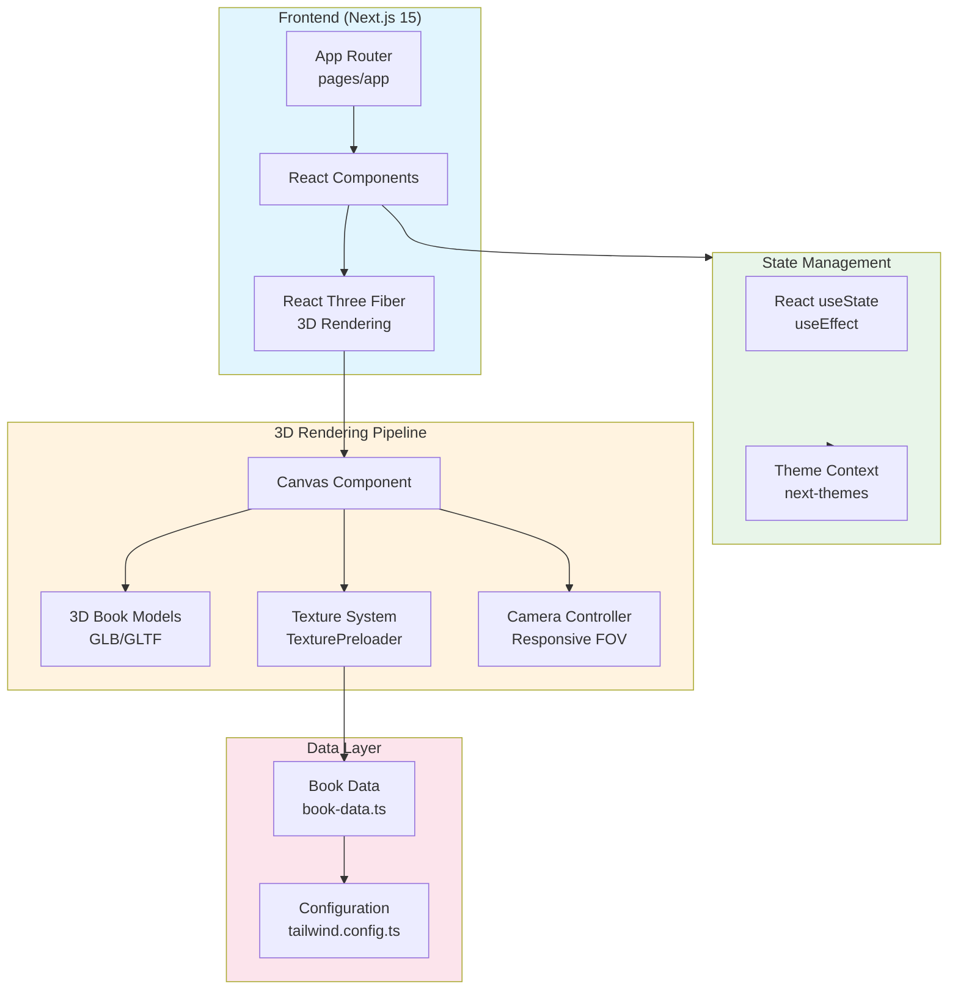

# Book Rendering Design

> A **3D book showcase** application featuring interactive 3D book rendering with realistic materials, smooth animations, and responsive design.

[](https://vercel.com/gileb64375-5584s-projects/v0-book-rendering-design)
[](https://v0.app/chat/projects/ace3EwYrPnI)
[](https://nextjs.org)
[](https://docs.pmnd.rs/react-three-fiber)
[](https://www.typescriptlang.org)

---

## Table of Contents

- [System Architecture](#system-architecture)
- [Features](#features)
- [Tech Stack](#tech-stack)
- [Getting Started](#getting-started)
- [Configuration](#configuration)
- [Project Stats](#project-stats)
- [Environment Variables](#environment-variables)

---

## System Architecture



---

## Features

### Core Features
- **3D Book Rendering** - Real-time 3D book visualization using Three.js & React Three Fiber
- **Interactive Book Navigation** - Smooth flip animations with keyboard arrow support (← →)
- **Multiple Book Support** - Showcase multiple books with seamless transitions
- **Responsive Design** - Adaptive layouts for mobile, tablet, and desktop

### Visual Features
- **Realistic Materials** - PBR materials with customizable properties (roughness, metalness)
- **Texture Preloading** - Efficient texture loading with progress tracking
- **Dynamic Background** - Color transitions between different books
- **Camera Animations** - Smooth FOV adjustments based on screen size

### Debug Features
- **Debug Panel** - Real-time parameter adjustment (position, rotation, scale)
- **Material Controls** - Live material property tweaking
- **UV Debugger** - Texture coordinate visualization
- **Console Logging** - Parameter export functionality

### UI/UX Features
- **Dark/Light Theme** - System theme support via next-themes
- **Component Library** - Radix UI primitives for accessibility
- **Custom Typography** - Geist font family integration

---

## Tech Stack

### Framework & Runtime
| Technology | Version | Purpose |
|------------|---------|---------|
| **Next.js** | 15.2.4 | React framework with App Router |
| **React** | 19 | UI library |
| **TypeScript** | 5 | Type safety |
| **Node.js** | 22+ | Runtime environment |

### 3D & Graphics
| Technology | Version | Purpose |
|------------|---------|---------|
| **Three.js** | latest | 3D rendering engine |
| **React Three Fiber** | latest | React renderer for Three.js |
| **React Three Drei** | latest | Useful helpers for R3F |

### UI Components
| Technology | Version | Purpose |
|------------|---------|---------|
| **Radix UI** | 1.2.x | Unstyled, accessible primitives |
| **Tailwind CSS** | 3.4.17 | Utility-first CSS |
| **Lucide React** | 0.454.0 | Icon library |
| **Tailwind Animate** | 1.0.7 | Animation utilities |

### Development Tools
| Technology | Version | Purpose |
|------------|---------|---------|
| **pnpm** | latest | Package manager |
| **PostCSS** | 8.5 | CSS transformation |
| **Autoprefixer** | 10.4.20 | CSS vendor prefixes |

---

## Getting Started

### Prerequisites

> **Note:** Ensure you have the following installed:
- Node.js 22 or higher
- pnpm (recommended) or npm/yarn

### Installation

```bash
# Clone the repository
git clone <repository-url>

# Navigate to project directory
cd book-rendering-design

# Install dependencies
pnpm install
```

### Development

```bash
# Start development server
pnpm dev

# Open http://localhost:3000 in browser
```

### Production Build

```bash
# Create production build
pnpm build

# Start production server
pnpm start
```

### Linting

```bash
# Run ESLint
pnpm lint
```

---

## Configuration

### TypeScript Configuration (`tsconfig.json`)

```json
{
  "compilerOptions": {
    "lib": ["dom", "dom.iterable", "esnext"],
    "target": "ES6",
    "strict": true,
    "module": "esnext",
    "moduleResolution": "bundler",
    "jsx": "preserve",
    "incremental": true,
    "plugins": [{ "name": "next" }],
    "paths": { "@/*": ["./*"] }
  }
}
```

### Tailwind Configuration (`tailwind.config.ts`)

- **Dark Mode**: Class-based via `darkMode: ['class']`
- **Content Paths**: `app/`, `components/`, `pages/`
- **Custom Colors**: Full color palette (background, foreground, primary, secondary, etc.)
- **Animations**: Accordion animations support

### Next.js Configuration (`next.config.mjs`)

- Standard Next.js configuration
- Supports all Next.js 15 features

### PostCSS Configuration (`postcss.config.mjs`)

- **Plugins**: `tailwindcss`, `autoprefixer`

---

## Project Stats

| Metric | Value |
|--------|-------|
| **Total Commits** | 11 |
| **Languages** | TypeScript, JavaScript, CSS |
| **Dependencies** | 40+ packages |
| **UI Components** | 30+ Radix primitives |
| **3D Components** | 8 specialized components |
| **Build Status** | ✅ Active |

---

## Environment Variables

The project uses the following environment variables:

| Variable | Description | Default |
|----------|-------------|---------|
| `NODE_ENV` | Runtime environment | `development` |
| `NEXT_PUBLIC_*` | Public environment variables | N/A |

> **Note:** Debug features are automatically disabled in production (`NODE_ENV !== 'production'`).

---

## Project Structure

```
book-rendering-design/
├── app/                    # Next.js App Router
│   ├── page.tsx           # Main page
│   ├── layout.tsx         # Root layout
│   ├── client-layout.tsx # Client layout
│   └── globals.css        # Global styles
├── components/            # React components
│   ├── ui/               # UI primitives (Button, Badge)
│   ├── book-showcase/    # 3D book components
│   │   ├── book-canvas.tsx
│   │   ├── book-3d-model.tsx
│   │   ├── book-details.tsx
│   │   ├── book-data.ts
│   │   ├── texture-manager.tsx
│   │   ├── texture-preloader.tsx
│   │   ├── camera-controller.tsx
│   │   ├── debug-panel.tsx
│   │   └── types.ts
│   └── theme-provider.tsx
├── public/               # Static assets
│   ├── images/          # Book cover images
│   ├── models/          # 3D GLB models
│   └── placeholder.*    # Placeholder assets
├── lib/                  # Utilities
│   └── utils.ts         # Helper functions
├── package.json         # Dependencies
├── tsconfig.json        # TypeScript config
├── tailwind.config.ts   # Tailwind config
├── postcss.config.mjs   # PostCSS config
└── next.config.mjs      # Next.js config
```

---

## Available Scripts

| Command | Description |
|---------|-------------|
| `pnpm dev` | Start development server |
| `pnpm build` | Create production build |
| `pnpm start` | Start production server |
| `pnpm lint` | Run ESLint |

---

## Deployment

The project is automatically deployed to Vercel. Any changes pushed to the main branch will trigger a new deployment.

**Live URL**: [v0-book-rendering-design](https://vercel.com/gileb64375-5584s-projects/v0-book-rendering-design)

---

## License

This project is for demonstration purposes and is synchronized with v0.app deployments.